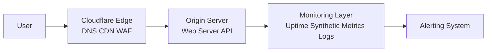

# Cloudflare Monitoring Architecture (Reference)

## Reference Architecture
This diagram represents a typical Cloudflare-based architecture with monitoring and alerting integrated for visibility and incident response.

Monitoring Components:
- Uptime Monitoring (external checks)
- Synthetic Monitoring (user journey checks)
- Metrics (CPU, memory, latency)
- Logs (application + system)
- Error Tracking

Alerting:
- Alert routing based on severity
- Escalation paths
- Notification channels (email, Slack, etc.)

Outcome:
- Fast detection of issues
- Clear identification of fault domain (DNS, edge, origin, app)
- Structured response and recovery

## When to Use This

This architecture is typically applied when:

- migrating DNS or infrastructure to Cloudflare  
- diagnosing website performance or availability issues  
- implementing monitoring and alerting from scratch  
- improving incident response and outage handling  
